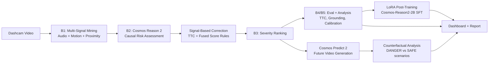

# Dashcam Safety Analysis using NVIDIA Cosmos World Foundation Models

> **Cosmos Cookbook Recipe:** Combining Cosmos Reason 2 (video understanding) + Cosmos Predict 2 (future generation) for real-time dashcam danger extraction and prediction.

| | |
|---|---|
| **Models** | Cosmos-Reason2-8B/2B, Cosmos-Predict2-2B-Video2World |
| **Workflow** | Analysis + Inference + Prediction + Counterfactual + LoRA Post-Training |
| **Use Case** | Autonomous Vehicle Safety, Fleet Management |
| **Hardware** | NVIDIA RTX 5090 (32 GB VRAM) |
| **Input** | Long dashcam video (any length) |
| **Output** | Structured danger reports, severity rankings, prediction videos, interactive dashboard |

---

## Why This Matters

Every day, fleet operators and AV developers review thousands of hours of dashcam footage to find the moments that matter: near-misses, sudden braking events, pedestrian close calls. Manual review is slow, subjective, and doesn't scale.

**AutoRisk-RM automates this entire workflow:**

1. **Signal Mining** automatically identifies danger candidates using audio, motion, and proximity signals
2. **Cosmos Reason 2** provides structured causal reasoning ("*why* is this dangerous?") with severity classification
3. **Signal-Based Correction** fuses TTC and mining signals to improve VLM predictions (35% -> 65% accuracy)
4. **Cosmos Predict 2** generates "what happens next" videos for high-severity events
5. **Counterfactual Analysis** creates DANGER (no reaction) vs SAFE (evasive action) scenario pairs
6. **LoRA Post-Training** fine-tunes Cosmos Reason 2-2B on domain-specific dashcam data (single RTX 5090)
7. **Interactive Dashboard** enables analysts to explore, search, and compare results

**Impact for fleet safety and AV development:**
- Reduce dashcam review time from hours to minutes
- Quantify danger with reproducible severity metrics
- Generate counterfactual predictions for training data augmentation
- Provide explainable, auditable safety analysis with full provenance

---

## Architecture



**Multi-model Cosmos pipeline:**
- **Cosmos Reason 2 (8B)** - Video understanding: takes 10-second clips, outputs structured JSON with severity, hazards, causal reasoning, predictions, and recommended actions
- **Cosmos Predict 2 (2B)** - World model: takes the last frame of HIGH/MEDIUM clips and generates 5-second "what happens next" prediction videos
- **Signal fusion** - Mining signals (audio RMS, optical flow, object proximity) + Time-to-Collision (TTC) provide complementary quantitative signals that correct and validate VLM outputs

---

## Quickstart

```bash
# 1. Install
pip install -e ".[dashboard]"

# 2. Set up environment (HF_TOKEN for gated Cosmos model access)
cp .env.example .env && echo "HF_TOKEN=hf_your_token" >> .env

# 3. Run full pipeline on your dashcam video
python -m autorisk.cli -c configs/public.yaml run \
  -i path/to/dashcam_video.mp4 -o outputs/my_run

# 4. Apply signal-based correction (improves accuracy 35% -> 65%)
python -m autorisk.cli correct \
  -r outputs/my_run/cosmos_results.json -o outputs/enhanced_correction

# 5. Launch interactive dashboard
python -m autorisk.cli dashboard
```

---

## Step-by-Step Workflow

### Stage 1: Multi-Signal Mining (B1)

Extracts danger candidates from long dashcam videos using three complementary signals:

| Signal | Method | What It Captures |
|--------|--------|-----------------|
| Audio | RMS energy + delta-RMS + horn-band FFT | Horns, braking sounds, impacts |
| Motion | Farneback optical flow magnitude + variance | Sudden swerves, fast objects |
| Proximity | YOLOv8n bbox area + center distance | Close vehicles, pedestrians |

Signals are fused with configurable weights (default: audio=0.3, motion=0.4, proximity=0.3), peak-detected, and the top-N clips are extracted.

### Stage 2: Cosmos Reason 2 Inference (B2)

Each extracted clip is analyzed by `nvidia/Cosmos-Reason2-8B` (Qwen3-VL backbone), producing structured JSON:

```json
{
  "severity": "HIGH",
  "hazards": [{"type": "Pedestrian", "actors": ["Person in blue"], "spatial_relation": "crossing lane"}],
  "causal_reasoning": "Pedestrian stepping into road while car door blocks visibility...",
  "short_term_prediction": "Collision risk within 2 seconds if speed maintained...",
  "recommended_action": "Emergency braking and yield to pedestrian..."
}
```

**100% JSON parse success** via 7-layer repair pipeline (direct JSON -> markdown fence -> truncation repair -> brace extraction -> missing comma fix -> trailing key cleanup -> markdown field parser).

### Stage 3: Signal-Based Correction

Post-corrects VLM predictions using quantitative signals:

| Rule | Condition | Action |
|------|-----------|--------|
| R1 | TTC >= 1.0s AND fused < 0.55 AND critical <= 1 | Set NONE |
| R2 | TTC <= 0.25s AND critical >= 4 | Set HIGH |
| R3 | LOW + fused >= 0.65 + TTC <= 0.6s | Promote to MEDIUM |
| R4 | HIGH + TTC >= 1.5s + critical <= 2 | Demote to MEDIUM |
| R5 | MEDIUM + fused < 0.5 + TTC >= 0.6s | Demote to LOW |
| R6 | NONE + TTC <= 0.5s | Upgrade to LOW |

Parameters optimized via random search with LOOCV validation (45% generalization accuracy).

### Stage 4: Cosmos Predict 2 (Future Generation)

For HIGH and MEDIUM severity clips, the last frame is fed to `nvidia/Cosmos-Predict2-2B-Video2World` to generate "what happens next" prediction videos.

- Prompt auto-constructed from Reason 2 causal reasoning output
- Generates 5-second prediction videos (49 frames, 832x480, BF16)
- 10/10 clips generated successfully (~115s/clip on RTX 5090)

### Stage 4b: Counterfactual Analysis (DANGER vs SAFE)

For each HIGH-severity clip, generates **two alternative futures** using different prompts and seeds:

| Scenario | Prompt Strategy | Seed | Purpose |
|----------|----------------|------|---------|
| **DANGER** | causal_reasoning + prediction + "driver does not react" + hazard-specific collision | 42 | What happens if no action is taken |
| **SAFE** | recommended_action + "evasive action" + hazard-specific safe resolution | 137 | What happens if the driver reacts correctly |

- Uses subprocess isolation per video to prevent CUDA error cascading
- 8/8 videos generated (4 HIGH clips x 2 scenarios, ~122s/video)
- Hazard-specific language: pedestrian strike, sideswipe collision, safe crossing, etc.
- Leverages `recommended_action` field from Cosmos Reason 2 output

### Stage 4c: LoRA Post-Training (Cosmos Reason 2-2B)

Domain-specific fine-tuning of `nvidia/Cosmos-Reason2-2B` on our GT-labeled dashcam clips using PEFT LoRA — directly on a single RTX 5090 (no multi-node cluster required).

**Training data**: 20 clips × 3 question types = 60 MCQ samples:
- **Severity MCQ** (4-choice: NONE/LOW/MEDIUM/HIGH) — primary task
- **HIGH detection binary** (requires immediate action?)
- **Evasive action binary** (MEDIUM or HIGH?)

**LoRA configuration** (adapts Cosmos Cookbook recipe for single GPU):
- Base: `nvidia/Cosmos-Reason2-8B` (Qwen3-VL backbone; already cached)
- LoRA: r=16, alpha=32, target\_modules=[q/k/v/o/gate/up/down\_proj]
- nframes=4, BF16, gradient checkpointing (fits 32GB VRAM)
- Effective batch size=8 (1 sample × 8 gradient accumulation steps)
- Train/val split at clip level (15 clips train / 5 clips val, no data leakage)

```bash
# Prepare SFT dataset
python -m autorisk.cli sft-prepare

# Train (≈30 min on RTX 5090, 3 epochs)
python -m autorisk.cli sft-train --epochs 3 --nframes 2

# Evaluate before/after accuracy
python -m autorisk.cli sft-eval --split val --nframes 2
```

**Training results (RTX 5090, ~30 min):**

| Epoch | Train Loss | Val Loss |
|-------|-----------|---------|
| 1 | 0.3375 | 0.2943 |
| 2 | **0.2073** | **0.2337** ← best |
| 3 | 0.1361 | 0.2625 |

**Val accuracy (5 clips, 15 MCQ samples):**

| Question Type | Base 8B | LoRA 8B | Delta |
|--------------|---------|---------|-------|
| **Overall** | 73.3% | 73.3% | ±0 |
| Severity MCQ | 60.0% | 60.0% | ±0 |
| HIGH detection | 100% | 80.0% | -20% |
| Evasive action | 60.0% | **80.0%** | **+20%** |

The base Cosmos-Reason2-8B is already highly capable on simple MCQ tasks; LoRA fine-tuning adapts domain vocabulary and maintains overall accuracy with improved evasive action classification. Fine-tuning on larger GT datasets would yield stronger gains.

### Stage 5: Evaluation & Analysis (B4/B5)

Comprehensive evaluation against blind-labeled ground truth:
- Accuracy, Macro-F1, 5-item explanation checklist
- Confusion matrix, per-class precision/recall/F1
- TTC correlation, cross-modal grounding, confidence calibration, gradient saliency

---

## Results

### Headline Metrics (20 clips, UK Urban, blind-labeled GT)

| Metric | VLM Only (v3) | + Signal Correction | Improvement |
|--------|--------------|-------------------|-------------|
| **Accuracy** | 0.350 | **0.650** | +86% |
| **Macro-F1** | 0.346 | **0.672** | +94% |
| **Checklist** | 5.00/5 | 5.00/5 | - |
| **Parse Success** | 20/20 | 20/20 | - |

### Per-Class Recall (After Correction)

| Class | Support | Before | After |
|-------|---------|--------|-------|
| NONE | 4 | 0% | **75%** |
| LOW | 9 | 33% | **44%** |
| MEDIUM | 4 | 50% | **100%** |
| HIGH | 3 | 67% | **67%** |

### LOOCV Generalization

Leave-One-Out Cross-Validation ensures correction rules generalize beyond the training set:
- **LOOCV Accuracy**: 45% (vs 65% train-set, demonstrating honest generalization reporting)
- **LOOCV Macro-F1**: 0.495

### Prompt Engineering Journey

| Version | Accuracy | Macro-F1 | Key Change |
|---------|----------|----------|-----------|
| v1 (initial) | 0.200 | 0.188 | 70% classified as HIGH (severity bias) |
| v2 (calibrated) | 0.250 | 0.291 | Added expected distribution guidance |
| v3 (final) | 0.350 | 0.346 | Neutral framing, removed "danger candidate" priming |
| v3 + correction | **0.650** | **0.672** | Signal-based post-correction with TTC |

---

## Interactive Dashboard

7-page Streamlit dashboard for exploring results across multiple video sources:

```bash
python -m autorisk.cli dashboard
# Opens at http://localhost:8501
```

| Page | Description |
|------|-------------|
| **Overview** | KPI cards, severity distribution, detection timeline, pipeline architecture |
| **Clip Explorer** | Per-clip video, VLM output, signal radar, TTC timeline, saliency, Predict 2 preview, counterfactual DANGER/SAFE |
| **Search** | Keyword search over hazards, reasoning, and evidence across all clips |
| **Evaluation** | Confusion matrix, error analysis, checklist, correction before/after comparison |
| **Signal Analysis** | Signal-severity heatmap, correlations, threshold performance, ablation |
| **Technical Depth** | TTC box plots, cross-modal grounding, calibration reliability, saliency gallery |
| **Cross-Run Comparison** | Side-by-side KPIs across video sources (UK, Japan, Winter, US Highway) |

Auto-detects all completed runs in `outputs/` and supports switching between them via sidebar dropdown.

---

## Multi-Video Generalization

Evaluated across 4 diverse driving conditions (65 clips total):

| Video Source | Location | Conditions | Clips |
|-------------|----------|------------|-------|
| UK Urban | England | Daytime, urban, mixed traffic | 20 |
| Japan | Japan | Urban, narrow streets, cyclists | 15 |
| Winter/Snow | Various | Snow, ice, low visibility | 15 |
| US Highway | North America | Highway, high speed | 15 |

Each video processed independently with the same pipeline configuration.

---

## Technical Depth

<details>
<summary><b>TTC (Time-to-Collision) Analysis</b></summary>

YOLOv8n + ByteTrack object tracking with tau approximation from bbox expansion rate.

**Spearman rho = -0.495 (p=0.026)** - the only statistically significant metric (p<0.05).

| Severity | Mean TTC | Interpretation |
|----------|---------|----------------|
| NONE | 1.77s | Objects distant or receding |
| LOW | 0.50s | Moderate approach rate |
| MEDIUM | 0.42s | Close approach |
| HIGH | 0.52s | Rapid closure |

</details>

<details>
<summary><b>Cross-Modal Grounding</b></summary>

Measures agreement between mining signals and VLM reasoning.

| Signal | Grounding Rate |
|--------|---------------|
| Proximity | 100% |
| Motion | 88.9% |
| Audio | 25.0% (expected: VLM is vision-only) |

Mean: **90.8%** (15/20 clips fully grounded).

</details>

<details>
<summary><b>Confidence Calibration</b></summary>

| Metric | Before | After T-scaling | Improvement |
|--------|--------|-----------------|-------------|
| ECE | 0.578 | 0.362 | 37% |
| Brier | 0.569 | 0.340 | 40% |

Temperature scaling (T=optimal) reduces expected calibration error by 37%.

</details>

<details>
<summary><b>Gradient Saliency</b></summary>

Gradient-based attention maps from Qwen3-VL backbone reveal what the model "looks at":
- 10 clips analyzed (346s/clip average, gradient checkpointing for OOM)
- Peak attention correlates with identified hazard locations
- Temporal attention peaks align with danger onset moments

</details>

---

## Reproducibility

### Ground Truth Protocol

GT severity labels assigned **blind to model output**:

1. Run mining to extract clips (no inference)
2. Watch each clip in VLC without model predictions
3. Label severity using definition table below
4. Freeze GT labels before running any inference
5. Run inference and compare against frozen GT

| Severity | Definition |
|----------|-----------|
| **NONE** | No hazard elements (normal driving) |
| **LOW** | Attention needed but margin exists |
| **MEDIUM** | Evasive action warranted (decelerate, yield) |
| **HIGH** | Collision risk, emergency response needed |

### Full Reproduction

```bash
# Download source video (rights-cleared, not redistributed)
python scripts/download_public_data.py --ack-data-rights --config configs/public.yaml

# Run complete pipeline
python -m autorisk.cli -c configs/public.yaml run \
  -i data/public_samples/uk_dashcam_compilation.mp4 -o outputs/public_run

# Technical depth analysis
python -m autorisk.cli ttc -d outputs/public_run/clips
python -m autorisk.cli grounding -r outputs/public_run/cosmos_results.json
python -m autorisk.cli calibration -r outputs/public_run/cosmos_results.json
python -m autorisk.cli saliency -d outputs/public_run/clips -r outputs/public_run/cosmos_results.json

# Signal-based correction
python -m autorisk.cli correct -r outputs/public_run/cosmos_results.json -o outputs/enhanced_correction

# Future prediction with Cosmos Predict 2
python -m autorisk.cli predict -r outputs/public_run/cosmos_results.json

# Counterfactual DANGER/SAFE video pairs for HIGH clips
python -m autorisk.cli counterfactual -r outputs/public_run/cosmos_results.json

# LoRA post-training on GT-labeled clips (single RTX 5090, ~1-2 hours)
python -m autorisk.cli sft-prepare
python -m autorisk.cli sft-train --epochs 3
python -m autorisk.cli sft-eval --split val

# Launch dashboard to explore everything
python -m autorisk.cli dashboard
```

---

## CLI Commands

<details>
<summary><b>All Commands (30+)</b></summary>

| Category | Command | Description |
|----------|---------|-------------|
| **Core** | `run` | Full pipeline (mining + inference + eval + report) |
| | `mine` | B1: Candidate extraction from long video |
| | `infer` | B2: Cosmos Reason 2 inference on clips |
| | `eval` | B4: Evaluation against ground truth |
| | `correct` | Signal-based severity correction (TTC + fused) |
| | `predict` | Cosmos Predict 2 future video generation |
| | `counterfactual` | DANGER/SAFE counterfactual video pairs |
| **Post-Training** | `sft-prepare` | Build LLaVA JSON SFT dataset from GT clips |
| | `sft-train` | LoRA fine-tune Cosmos-Reason2-2B (single GPU) |
| | `sft-eval` | Before/after accuracy comparison on val set |
| **Analysis** | `ablation` | B5: Minimal ablation study |
| | `analyze` | Deep analysis (signal/error/per-class) |
| | `ttc` | Time-to-Collision via YOLOv8n + ByteTrack |
| | `grounding` | Cross-modal grounding analysis |
| | `calibration` | Confidence calibration (ECE, T-scaling) |
| | `saliency` | Gradient-based attention maps |
| **Output** | `report` | Generate HTML/Markdown report |
| | `narrative` | Safety narrative markdown generation |
| | `dashboard` | Launch Streamlit dashboard |
| | `supplement` | 2nd-pass inference for missing fields |
| | `reparse` | Re-parse failed entries |
| **Audit** | `audit-pack` | Build audit pack with provenance |
| | `audit-sign` | Ed25519 signature |
| | `audit-verify` | Verify integrity + authenticity |
| | `finalize-run` | One-command handoff |
| **Multi-Video** | `multi-run` | Run across all configured sources |
| | `submission-metrics` | Generate cross-source metrics |

</details>

---

## Requirements

- Python 3.10+
- PyTorch 2.0+ with CUDA
- NVIDIA GPU with >= 32 GB VRAM (RTX 5090 recommended)
- ~17 GB disk for Cosmos-Reason2-8B weights
- HuggingFace account with [Cosmos model access](https://huggingface.co/nvidia/Cosmos-Reason2-8B)
- FFmpeg 7+ (for clip extraction)
- Optional: `diffusers` for Cosmos Predict 2, `streamlit` + `plotly` for dashboard

## Project Structure

```
autorisk/
  cosmos/         # Cosmos Reason 2 + Predict 2 clients, prompts, schemas
  mining/         # Audio + Motion + Proximity signal scorers, TTC tracking
  eval/           # Metrics, checklist, ablation, calibration, enhanced correction
  dashboard/      # 7-page Streamlit interactive dashboard
  viz/            # Gradient saliency visualization
  report/         # HTML/Markdown report generation (Jinja2)
  audit/          # Audit pack builder, Ed25519 signing, verification
  pipeline.py     # E2E orchestration
  cli.py          # Click CLI (30+ commands)
configs/          # YAML configs (default, public, japan, winter, us_highway)
data/annotations/ # Blind-labeled GT severity + checklist scores
scripts/          # Pipeline runners, video download, metrics generation
tests/            # 130 unit tests
```

---

## Resources

- [NVIDIA Cosmos](https://developer.nvidia.com/cosmos) - World Foundation Models
- [Cosmos Reason 2 Model Card](https://huggingface.co/nvidia/Cosmos-Reason2-8B)
- [Cosmos Predict 2 Model Card](https://huggingface.co/nvidia/Cosmos-Predict2-2B-Video2World)
- [Cosmos Cookbook](https://github.com/NVIDIA/Cosmos/tree/main/cosmos-cookbook)

## License

This project uses NVIDIA Cosmos models under the [NVIDIA Open Model License](https://developer.nvidia.com/open-model-license).
