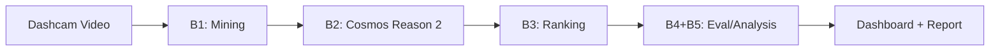

# AutoRisk-RM: Automated Risk Mining from Dashcam Videos

End-to-end pipeline that automatically extracts dangerous moments from long dashcam videos and uses **NVIDIA Cosmos Reason 2** for causal reasoning, severity classification, and action recommendations.

> **Results Summary** (20 clips, UK Urban, blind-labeled GT)
>
> **Accuracy**: 0.350 | **Macro-F1**: 0.346 | **Checklist**: 5.00/5 | **Parse Success**: 20/20 (100%)
>
> **TTC Correlation**: ρ=-0.495 (p=0.026) | **Grounding**: 90.8% | **ECE**: 0.362 (after calibration)

## Architecture



**Pipeline stages:**
- **B1: Multi-signal mining** - Audio (RMS/horn) + Optical Flow (Farneback) + Proximity (YOLOv8n) → weighted fusion → Top-N clips
- **B2: Cosmos Reason 2** - Local 8B model inference → structured JSON (severity, hazards, causal reasoning, predictions, actions)
- **B3: Severity ranking** - HIGH > MEDIUM > LOW > NONE with tiebreakers
- **B4/B5: Evaluation** - Accuracy, F1, checklist, ablation study, deep analysis (TTC, grounding, calibration)

## Key Features

- **Multi-signal danger mining**: Fuses audio (RMS, delta-RMS, horn-band detection), optical flow (Farneback magnitude + variance), and object proximity (YOLOv8n bbox area + center distance) with configurable weights
- **Cosmos Reason 2 video understanding**: Local inference on GPU with `nvidia/Cosmos-Reason2-8B` (Qwen3VL backbone). Official guidance: >=32 GB VRAM, BF16 recommended. Produces structured JSON with severity, hazard details, causal reasoning, predictions, and recommended actions
- **100% JSON parse success**: Robust multi-layer parsing with truncation repair (direct JSON → markdown fence → open fence + truncation repair → brace extraction → missing comma fix → trailing key cleanup → markdown field parser)
- **Reproducible Public Mode**: One-command pipeline using user-provided or rights-cleared public footage with blind-labeled ground truth
- **Interactive Streamlit dashboard**: 7-page UI for exploring results across multiple runs

## Quickstart

```bash
# 1. Install
pip install -e .
pip install -e ".[dashboard]"  # Optional: Streamlit dashboard

# 2. Set up environment
cp .env.example .env
# Add your HF_TOKEN (for gated Cosmos model access)

# 3. Run full pipeline on public video
# (Use a rights-cleared local source path)
python -m autorisk.cli -c configs/public.yaml run \
  -i data/public_samples/uk_dashcam_compilation.mp4 \
  -o outputs/public_run

# 4. View results
streamlit run autorisk/dashboard/app.py
# Or: Open outputs/public_run/report.html in browser
```

See `DATA_SOURCES.md` for source policy, rights notes, and redistribution rules.

## Judge One-Command (Audit Grade)

Use one command to produce handoff artifacts, sign, verify, and print pack fingerprint.

```bash
# Linux/macOS
bash scripts/judge_run.sh

# Windows PowerShell
powershell -ExecutionPolicy Bypass -File scripts/judge_run.ps1
```

If your source video is not at `data/public_samples/uk_dashcam_compilation.mp4`, set:

```bash
AUTORISK_INPUT_VIDEO=/path/to/rights-cleared-video.mp4
```

## Interactive Dashboard

Streamlit-based dashboard with 7 pages for exploring results across multiple runs.

```bash
# Launch dashboard
python -m autorisk.cli dashboard
# Or: streamlit run autorisk/dashboard/app.py
```

**Pages:**
- **Overview**: KPI cards, severity distribution, detection timeline, architecture diagram
- **Clip Explorer**: Per-clip video playback, VLM output, signal radar, TTC timeline, saliency heatmap
- **Search**: Keyword search over hazards, reasoning, and evidence across all clips
- **Evaluation**: Confusion matrix, error analysis, checklist breakdown
- **Signal Analysis**: Signal-severity heatmap, correlations, threshold performance, ablation
- **Technical Depth**: TTC box plots, cross-modal grounding, calibration reliability, saliency gallery
- **Cross-Run Comparison**: Side-by-side KPIs across video sources (UK, Japan, Winter, US Highway)

The dashboard auto-detects all completed runs in `outputs/` and supports switching between them via the sidebar dropdown.

## Results (Public Mode, 20 clips)

### Headline Metrics

| Metric | v1 (initial) | v2 (calibrated) | v3 (final) |
|--------|-------|-------|-------|
| Accuracy | 0.200 | 0.250 | **0.350** |
| Macro-F1 | 0.188 | 0.291 | **0.346** |
| Checklist | 3.83/5 | 3.00/5 | **5.00/5** |
| Parse success | 19/20 | 17/20 | **20/20** |

### Confusion Matrix (rows=GT, cols=Predicted)
|  | NONE | LOW | MEDIUM | HIGH |
|------|------|-----|--------|------|
| **NONE** (4) | 0 | 3 | 1 | 0 |
| **LOW** (9) | 1 | 3 | 4 | 1 |
| **MEDIUM** (4) | 0 | 2 | 2 | 0 |
| **HIGH** (3) | 1 | 0 | 0 | 2 |

<details>
<summary><b>Key Findings</b></summary>

1. **Prompt engineering fixes HIGH-severity bias**: v1 classified 70% as HIGH (GT: 15%). Calibration guidance reduced this to 3/20 (matching GT), improving Macro-F1 by 84%.

2. **2-stage inference recovers explanation completeness**: Calibrated prompt → shorter outputs. Lightweight supplement pass → perfect 5.00/5 checklist without re-inference.

3. **Cosmos adds structured reasoning over baseline**: Mining-score baseline achieves comparable accuracy (0.350) but lacks explanation quality (1.00 vs 5.00 checklist).

4. **Multi-signal fusion outperforms individual signals**: Fused F1=0.412 > best individual 0.340. No single signal achieves statistical significance (all p>0.05).

5. **Conservative safety bias**: 69% of misclassifications are over-estimations — model errs toward caution (HIGH recall=66.7%).

6. **TTC validates severity**: Spearman ρ=-0.495 (p=0.026) — the only statistically significant metric (p<0.05).

</details>

<details>
<summary><b>Technical Depth Results</b></summary>

### Signal Contribution
| Signal | Spearman ρ | p-value | Threshold F1 |
|--------|-----------|---------|-------------|
| Audio | +0.192 | 0.418 | 0.340 |
| Motion | +0.140 | 0.556 | 0.250 |
| Proximity | +0.223 | 0.345 | 0.294 |
| **Fused** | **+0.192** | 0.418 | **0.412** |

### TTC Analysis
| Severity | Mean TTC | Interpretation |
|----------|---------|----------------|
| NONE | 1.77s | Objects distant or receding |
| LOW | 0.50s | Moderate approach rate |
| MEDIUM | 0.42s | Close approach |
| HIGH | 0.52s | Rapid closure |

**Spearman ρ = -0.495 (p=0.026)** — only metric with p<0.05.

### Confidence Calibration
| Metric | Before | After T-scaling | Improvement |
|--------|--------|-----------------|-------------|
| ECE | 0.578 | 0.362 | 37% |
| Brier | 0.569 | 0.340 | 40% |

### Cross-Modal Grounding
| Signal | Grounding Rate |
|--------|---------------|
| Proximity | 100% |
| Motion | 88.9% |
| Audio | 25.0% (expected: VLM is vision-only) |

Mean: **90.8%** (15/20 clips fully grounded).

### Per-Class Performance
| Class | Precision | Recall | F1 | Support |
|-------|-----------|--------|------|---------|
| NONE | 0.0% | 0.0% | 0.000 | 4 |
| LOW | 37.5% | 33.3% | 0.353 | 9 |
| MEDIUM | 28.6% | 50.0% | 0.364 | 4 |
| **HIGH** | **66.7%** | **66.7%** | **0.667** | 3 |

### Error Analysis
```
Over-estimation (predicted higher than GT):  9 errors (69%)
Under-estimation (predicted lower than GT):  4 errors (31%)

Adjacent miss (off by 1 severity level):    10 errors (77%)
Major miss (off by 2+ levels):               3 errors (23%)
```

</details>

## Public Mode (Reproducible Evaluation)

Public Mode uses user-provided or rights-cleared sources for reproducible evaluation.

### Step 1: Download source video

```bash
# Option A: Automated download with explicit rights acknowledgement
python scripts/download_public_data.py --ack-data-rights --config configs/public.yaml

# Option B: Manual download (if yt-dlp fails)
# yt-dlp -f 18 -o "data/public_samples/uk_dashcam_compilation.mp4" "https://www.youtube.com/watch?v=i7HspkH7aT4"
```

Source: [UK Dash Camera Compilation #1](https://www.youtube.com/watch?v=i7HspkH7aT4) by JA Dashcam UK (302s, 640x360, 30 FPS)

**Data usage note**: The source video is publicly available on YouTube under standard YouTube license. It is **not redistributed** in this repository — users download it directly from the original source via `yt-dlp` or manual download. Only the extracted 10-second analysis clips (transformative, analytical use) and ground-truth annotations (original work) are used for evaluation. No video data is included in the git repository.

**Policy note**: AutoRisk-RM does not grant source-media rights. You must review and confirm license/usage rights for any third-party input. See `DATA_SOURCES.md`.

### Step 2: Run pipeline

```bash
# Full pipeline (mining + Cosmos inference + ranking + eval + report)
# ~3 hours on RTX 5090 for 20 candidates
python -m autorisk.cli -c configs/public.yaml run \
  -i data/public_samples/uk_dashcam_compilation.mp4 \
  -o outputs/public_run

# Optional: if --input does not exist, allow explicit auto-download from config source_url
# python -m autorisk.cli -c configs/public.yaml run --mode public --allow-public-download \
#   -i data/public_samples/uk_dashcam_compilation.mp4 -o outputs/public_run
```

### Step 3: Evaluate and ablation (after inference completes)

```bash
# Evaluation against blind-labeled GT
python -m autorisk.cli eval \
  -r outputs/public_run/cosmos_results.json \
  -o outputs/public_run

# Minimal ablation (baseline score threshold vs Cosmos video)
python -m autorisk.cli ablation \
  -r outputs/public_run/cosmos_results.json \
  -g data/annotations/gt_labels.csv \
  -o outputs/public_run

# Generate HTML report
python -m autorisk.cli report \
  -r outputs/public_run/cosmos_results.json \
  -o outputs/public_run
```

## Ground Truth Labeling

GT severity labels in `data/annotations/gt_labels.csv` were assigned **blind to model output** using the following procedure:

1. **Mining first**: Run `autorisk mine` to extract 20 candidate clips from the dashcam video
2. **Watch clips only**: Review each 10-second clip in a video player (VLC) without running Cosmos inference
3. **Assign severity**: Label each clip using the criteria below, based solely on visual content
4. **Freeze GT**: Commit `gt_labels.csv` to the repository before running any inference
5. **Run inference**: Execute Cosmos analysis and compare predictions against the frozen GT

This blind-labeling protocol ensures GT labels are **not influenced by model predictions**, providing an honest evaluation baseline.

| Severity | Definition |
|----------|-----------|
| **NONE** | No hazard elements (normal driving) |
| **LOW** | Attention needed but margin exists (distant pedestrians, gentle merge) |
| **MEDIUM** | Evasive action warranted (decelerate, maintain distance, yield) |
| **HIGH** | Collision risk, emergency braking or swerving needed (close pass, cut-in, near-miss) |

## CLI Commands

<details>
<summary><b>Core Commands (11)</b></summary>

| Command | Description |
|---------|-------------|
| `run` | Full pipeline (mining + inference + eval + report) |
| `mine` | B1: Candidate extraction from long video |
| `infer` | B2: Cosmos inference on extracted clips |
| `eval` | B4: Evaluation against ground truth |
| `ablation` | B5: Minimal ablation study |
| `analyze` | Deep analysis (signal/error/per-class) |
| `report` | Generate HTML/Markdown report |
| `narrative` | Generate safety narrative markdown from results |
| `dashboard` | Launch Streamlit dashboard |
| `supplement` | 2nd-pass inference for missing fields |
| `reparse` | Re-parse failed entries without re-inference |

</details>

<details>
<summary><b>All Commands (30+)</b></summary>

```bash
# Full pipeline
python -m autorisk.cli run -i VIDEO -o OUTPUT_DIR

# Individual stages
python -m autorisk.cli mine -i VIDEO -o OUTPUT_DIR        # B1: Candidate extraction
python -m autorisk.cli infer -d CLIPS_DIR -o OUTPUT_DIR   # B2: Cosmos inference
python -m autorisk.cli eval -r RESULTS.json -o OUTPUT_DIR # B4: Evaluation
python -m autorisk.cli ablation -r RESULTS.json -o DIR    # B5: Minimal ablation
python -m autorisk.cli analyze -r RESULTS.json -o DIR     # Deep analysis
python -m autorisk.cli report -r RESULTS.json -o DIR      # Report generation
python -m autorisk.cli narrative -r RESULTS.json -o DIR/safety_narrative.md  # Safety narrative
python -m autorisk.cli supplement -r RESULTS.json         # Fill missing fields
python -m autorisk.cli reparse -r RESULTS.json            # Re-parse failures
python -m autorisk.cli dashboard                          # Launch dashboard

# Technical depth
python -m autorisk.cli ttc -d CLIPS_DIR -o DIR              # TTC via YOLOv8n + ByteTrack
python -m autorisk.cli grounding -r RESULTS.json -o DIR     # Cross-modal grounding
python -m autorisk.cli calibration -r RESULTS.json -o DIR   # Confidence calibration
python -m autorisk.cli saliency -d CLIPS_DIR -r RESULTS.json -o DIR  # Gradient saliency

# Audit trail
python -m autorisk.cli audit-pack -r RUN_DIR               # Build audit pack
python -m autorisk.cli audit-sign -p PACK --private-key keys/private.pem
python -m autorisk.cli audit-verify -p PACK --public-key keys/public.pem
python -m autorisk.cli audit-validate -p PACK --enforce
python -m autorisk.cli audit-handoff -r RUN_DIR --out handoff
python -m autorisk.cli audit-handoff-verify -d HANDOFF --enforce

# Human review
python -m autorisk.cli review-approve -r RUN_DIR --rank N --severity MEDIUM
python -m autorisk.cli review-apply -r RUN_DIR
python -m autorisk.cli policy-check -r RUN_DIR --policy configs/policy.yaml

# Multi-video
python -m autorisk.cli multi-run --repo-root . [--only japan]
python -m autorisk.cli submission-metrics --out outputs/metrics.json
python -m autorisk.cli multi-validate --run-summary RUN.json --enforce

# Finalization
python -m autorisk.cli finalize-run -r RUN_DIR --zip --audit-grade

# With config
python -m autorisk.cli -c configs/public.yaml run -i VIDEO -o OUTPUT_DIR
```

</details>

## Audit Trail

<details>
<summary><b>Audit Pack Details</b></summary>

The `audit-pack` command creates a complete audit trail for reproducibility and verification. For full details, see `AUDIT_CONTRACT.md`.

**Key files:**
- `manifest.json`: run/model/prompt provenance, file inventory, summary stats
- `decision_trace.jsonl`: per-clip signal scores, parsing/repair log, final decision, raw response
- `checksums.sha256.txt`: SHA256 chain for every file in the pack
- `signature.json`: Ed25519 signature (via `audit-sign`) over checksums + manifest
- `attestation.json`: Ed25519 attestation over non-checksummed artifacts (finalize/validate reports)

**Workflow:**
```bash
# Create audit pack
python -m autorisk.cli audit-pack -r outputs/public_run --zip

# Sign pack (Ed25519)
python -m autorisk.cli audit-sign -p audit_pack.zip --private-key keys/private.pem

# Verify integrity + authenticity
python -m autorisk.cli audit-verify -p audit_pack.zip --public-key keys/public.pem --profile audit-grade

# Validate contract compliance
python -m autorisk.cli audit-validate -p audit_pack.zip --enforce

# One-command handoff
python -m autorisk.cli finalize-run -r outputs/public_run --zip --audit-grade --handoff-out handoff_latest
```

See `AUDIT_CONTRACT.md` for full requirements and guarantees.

</details>

## Multi-Video Generalization

The pipeline is evaluated across diverse driving conditions to demonstrate generalization:

| Video Source | Location | Conditions | Clips |
|-------------|----------|------------|-------|
| UK Urban | England | Daytime, urban | 20 |
| Japan | Japan | Urban, mixed traffic | 15 |
| Winter/Snow | Various | Snow, ice, low visibility | 15 |
| US Highway | North America | Highway, high speed | 15 |

Each video is processed independently with the same pipeline (mining → Cosmos inference → supplement → TTC → grounding → report). Cross-run comparison on the dashboard visualizes how severity distributions, confidence, TTC, and grounding scores differ across conditions.

```bash
# Run all multi-video sources
python scripts/run_all_inference.py

# Run a single source
python scripts/run_all_inference.py --only japan

# Generate compact submission metrics JSON across configured sources
python scripts/generate_submission_metrics.py --out outputs/multi_video/submission_metrics.json

# Validate both artifacts (schema + semantic)
python -m autorisk.cli multi-validate \
  --run-summary outputs/multi_video/run_summary.json \
  --submission-metrics outputs/multi_video/submission_metrics.json \
  --enforce
```

## Requirements

- Python 3.10+
- PyTorch 2.0+ with CUDA (install separately from [pytorch.org](https://pytorch.org/get-started/locally/) — not included in `pip install -e .` to avoid CPU-only fallback)
- NVIDIA GPU with >=32 GB VRAM for official Cosmos-Reason2-8B guidance (BF16 recommended)
- ~17 GB disk for Cosmos-Reason2-8B model weights
- HuggingFace account with [model access](https://huggingface.co/nvidia/Cosmos-Reason2-8B)
- FFmpeg 7+ (for clip extraction)
- Optional dashboard dependencies: `streamlit`, `plotly` (`pip install -e ".[dashboard]"`)

## Project Structure

```
autorisk/
  audit/          # Audit pack builder (manifest/trace/checksums/zip)
  cosmos/         # B2: Local inference client, prompt templates, schemas
  dashboard/      # Streamlit interactive dashboard (7 pages)
    pages/        # Overview, Explorer, Evaluation, Signals, Depth, Comparison
  eval/           # B4/B5: Metrics, checklist, ablation, calibration, analysis
  mining/         # B1: Audio, motion, proximity signal scorers + fusion
    tracking.py   # TTC estimation (YOLOv8n + ByteTrack + tau approximation)
  policy/         # Review-gating policy checks and queue/report generation
  report/         # HTML/Markdown report generation (Jinja2)
  review/         # Human review logging and reviewed-result generation
  viz/            # Gradient saliency visualization (attention.py)
  pipeline.py     # E2E orchestration
  cli.py          # Click CLI (30+ commands)
configs/
  default.yaml    # Default configuration
  public.yaml     # Public mode (UK dashcam, reproducible)
  japan.yaml      # Japan urban driving
  winter.yaml     # Winter/snow conditions
  us_highway.yaml # US highway driving
data/
  annotations/    # GT labels (blind-labeled) and checklist scores
  multi_video/    # Downloaded dashcam videos (5 min clips)
scripts/
  download_public_data.py     # Public video downloader (yt-dlp)
  judge_run.sh                # One-command audit-grade run (Linux/macOS)
  judge_run.ps1               # One-command audit-grade run (PowerShell)
  run_all_inference.py        # Multi-video pipeline runner (unattended)
  generate_submission_metrics.py  # Cross-source submission metrics generator
DATA_SOURCES.md   # Source policy and rights guidance
```

## License

This project uses NVIDIA Cosmos Reason 2 under the [NVIDIA Open Model License](https://developer.nvidia.com/open-model-license).
